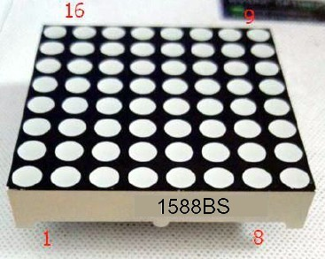
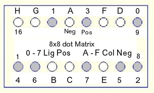
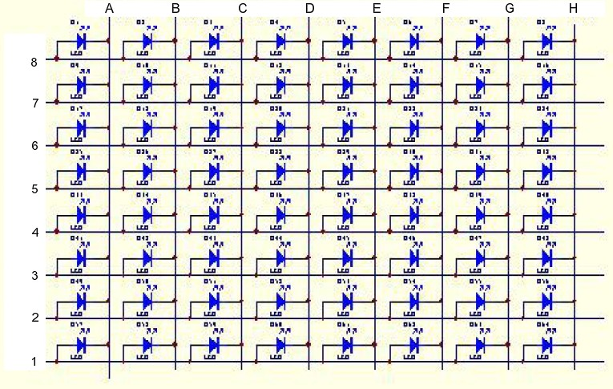
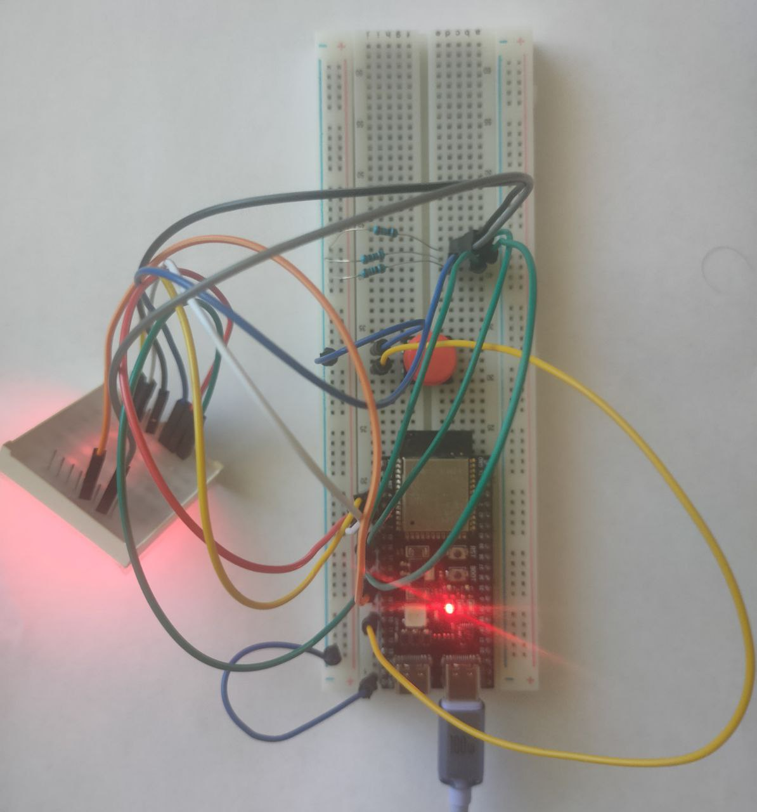

# Laboratory №1

## Topic

Installation of development tools and creation, debugging, and execution of projects in **VS Code** using the **ESP-IDF** framework.

## Objective

To become familiar with the process of installing the **VS Code** development environment and the **ESP-IDF** framework, and to learn how to create, compile, debug, and run projects for **ESP32** microcontrollers.

## Task Description

1. Install **VS Code** and **ESP-IDF** tools.
2. Create the first **Blink** project and configure it.
3. Complete two individual tasks:
   a. Modify the example code so that the LEDs display numbers from **0 to 9**.
   b. Add button press handling. After pressing the button, the system should display your **number in the group list**. If the number consists of **two digits**, the digits should be **displayed sequentially**.

## Installation of VS Code and ESP-IDF Tools

To install **VS Code**, you can follow this [instruction](https://code.visualstudio.com/docs/setup/windows#_install-vs-code-on-windows).  
To install the **ESP-IDF extension**, follow this [instruction](https://docs.espressif.com/projects/vscode-esp-idf-extension/en/latest/installation.html).

## Creating the First **Blink** Project and Its Configuration

This step is described in detail in the **README.MD** file located in the **main** branch.

## Components Used

1. **8×8 LED Dot Matrix 1588BS**
2. **ESP32S3-WROOM-1 microcontroller**
3. **Male-to-male jumper wires**
4. **Female-to-male jumper wires**
5. **Push button**
6. **3 resistors (1 kΩ each)**

## 8×8 LED Dot Matrix 1588BS Pinout






## 8×8 LED Dot Matrix 1588BS Diagram




## Breadboard Setup




## Task Implementation

a. Modify the example code so that the LEDs display numbers from **0 to 9**.

b. Add button press handling. After pressing the button, the system should display your **number in the group list**. If the number consists of **two digits**, the digits should be **displayed sequentially**.

Both tasks are implemented within the same program, therefore a single code block will be provided:

```c
#include <stdio.h>
#include <freertos/FreeRTOS.h>
#include <freertos/task.h>
#include <driver/gpio.h>
#include "sdkconfig.h"

#define ROWS 5
#define COLS 3
#define DIGITS 10

#define GPIO_BUTTON 10
const gpio_num_t row_pins[ROWS] = {
    GPIO_NUM_8, // 8 GPIO - 0 is logic row, but 2 row in the real LED matrix
    GPIO_NUM_3, // 3 GPIO - 1 is logic row, but 3 row in the real LED matrix
    GPIO_NUM_4, // 4 GPIO - 2 is logic row, but 4 row in the real LED matrix
    GPIO_NUM_5, // 5 GPIO - 3 is logic row, but 5 row in the real LED matrix
    GPIO_NUM_6  // 6 GPIO - 4 is logic row, but 6 row in the real LED matrix
};
const gpio_num_t col_pins[COLS] = {
    GPIO_NUM_15, // 15 GPIO - 0 is column logical, but 3 column in the real LED matrix
    GPIO_NUM_16, // 16 GPIO - 1 is column logical, but 4 column in the real LED matrix
    GPIO_NUM_17  // 17 GPIO - 2 is column logical, but 5 column in the real LED matrix
};

const uint8_t variant = 3;
const uint8_t digits[DIGITS][ROWS][COLS] = {
    { {0, 0, 0}, {0, 1, 0}, {0, 1, 0}, {0, 1, 0}, {0, 0, 0} },  // 0
    { {1, 1, 0}, {1, 0, 0}, {0, 1, 0}, {1, 1, 0}, {1, 1, 0} },  // 1
    { {0, 0, 0}, {1, 1, 0}, {0, 0, 0}, {0, 1, 1}, {0, 0, 0} },  // 2
    { {0, 0, 0}, {1, 1, 0}, {0, 0, 0}, {1, 1, 0}, {0, 0, 0} },  // 3
    { {0, 1, 0}, {0, 1, 0}, {0, 0, 0}, {1, 1, 0}, {1, 1, 0} },  // 4
    { {0, 0, 0}, {0, 1, 1}, {0, 0, 0}, {1, 1, 0}, {0, 0, 0} },  // 5
    { {0, 0, 0}, {0, 1, 1}, {0, 0, 0}, {0, 1, 0}, {0, 0, 0} },  // 6
    { {0, 0, 0}, {1, 1, 0}, {1, 1, 0}, {1, 1, 0}, {1, 1, 0} },  // 7
    { {0, 0, 0}, {0, 1, 0}, {0, 0, 0}, {0, 1, 0}, {0, 0, 0} },  // 8
    { {0, 0, 0}, {0, 1, 0}, {0, 0, 0}, {1, 1, 0}, {0, 0, 0} }   // 9
};

volatile bool running = false;

void print_led(const uint8_t pattern[ROWS][COLS]);
void task_LED(void *pvParameters);
void task_button(void *pvParameters);

void app_main(void) {
    // setting up button GPIO
    gpio_reset_pin(GPIO_BUTTON);
    gpio_set_direction(GPIO_BUTTON, GPIO_MODE_INPUT);
    // 0 - button not pressed, 1 - button pressed
    gpio_set_pull_mode(GPIO_BUTTON, GPIO_PULLUP_ONLY);

    // setting up row and column GPIOs
    for (int i = 0; i < ROWS; i++) {
    gpio_config_t io_conf_rows = {
        .pin_bit_mask = (1ULL << row_pins[i]),
        .mode = GPIO_MODE_OUTPUT,
        .pull_up_en = GPIO_PULLUP_DISABLE,
        .pull_down_en = GPIO_PULLDOWN_DISABLE,
        .intr_type = GPIO_INTR_DISABLE
    };
    gpio_config(&io_conf_rows);
}

for (int j = 0; j < COLS; j++) {
    gpio_config_t io_conf_cols = {
        .pin_bit_mask = (1ULL << col_pins[j]),
        .mode = GPIO_MODE_OUTPUT,
        .pull_up_en = GPIO_PULLUP_DISABLE,
        .pull_down_en = GPIO_PULLDOWN_DISABLE,
        .intr_type = GPIO_INTR_DISABLE
    };
    gpio_config(&io_conf_cols);
}

    xTaskCreate(task_LED, "LED Task", 2048, NULL, 1, NULL);
    xTaskCreate(task_button, "Button Task", 2048, NULL, 1, NULL);
}

void print_led(const uint8_t pattern[ROWS][COLS]) {
    for(int i = 0; i < ROWS; i++) {
        gpio_set_level(row_pins[i], 1);

        for(int j = 0; j < COLS; j++){
            gpio_set_level(col_pins[j], pattern[i][j]);
        }

        vTaskDelay(pdMS_TO_TICKS(3));
        gpio_set_level(row_pins[i], 0);
    }
}

void task_LED(void *pvParameters) {
    bool is_three_shown = false;
    while(1) {
        if (!running) {
            for(int d = 0; d < DIGITS; d++) {
                for(int t = 0; t < 100; t++){
                    print_led(digits[d]);
                    if(t == 0) {
                        printf("Number %d is shown\n", d);
                    }
                    if (running) break;
                }
                if (running) break;
                is_three_shown = false;
            }
        }
        else {
            print_led(digits[variant]);
            if (!is_three_shown) {
                printf("Number %d is shown\n", variant);
                is_three_shown = true;
            }
        }
    }
}

void task_button(void *pvParameters) {
    int last_state = 1;
    while(1) {
        int current_state = gpio_get_level(GPIO_BUTTON);
        if(current_state == 1 && last_state == 0){
            running = !running;
            printf("Button is pressed. Running state is now: %s\n", running ? "ON" : "OFF");
        }
        last_state = current_state;
        vTaskDelay(pdMS_TO_TICKS(50));
    }
}
```

## Results

In console:
```
Number 0 is shown
Number 1 is shown
Number 2 is shown
Number 3 is shown
Number 4 is shown
Number 5 is shown
Number 6 is shown
Number 7 is shown
Number 8 is shown
Number 9 is shown
Button is pressed. Running state is now: ON
Number 3 is show
```

To see the results in real operation, open the **videos** folder.  
It contains recordings demonstrating how the code works.
